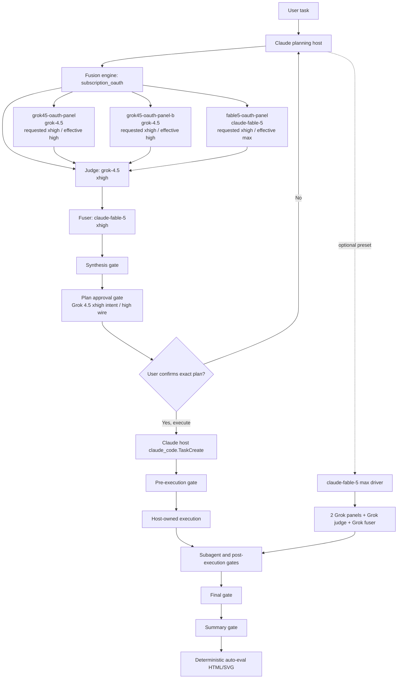

# claude-fusion-drive workflow_report (profile subscription-oauth) — extract
config_hash: "732b54e01bd2c87779bdb40617cab67ed66db035b13fbef6da22a00091869242"

## Mermaid

## Gates
- synthesis: automatic=True owner=fusion_engine requested=xhigh effective=high reviewers=['grok45-oauth-gate-primary', 'grok45-oauth-gate-secondary'] evidence=['panel_artifacts', 'judge_artifact', 'synthesis_hash']
- plan: automatic=False owner=claude_host requested=xhigh effective=high reviewers=['grok45-oauth-gate-primary', 'grok45-oauth-gate-secondary'] evidence=['requirements_trace', 'risk_analysis', 'workflow_report']
- pre_execution: automatic=False owner=claude_host requested=xhigh effective=high reviewers=['grok45-oauth-gate-primary', 'grok45-oauth-gate-secondary'] evidence=['confirmed_plan', 'goal_receipt', 'scope_boundaries']
- subagent_pre_execution: automatic=False owner=claude_host requested=xhigh effective=high reviewers=['grok45-oauth-gate-primary', 'grok45-oauth-gate-secondary'] evidence=['subagent_scope', 'preset_hash']
- subagent_post_execution: automatic=False owner=claude_host requested=xhigh effective=high reviewers=['grok45-oauth-gate-primary', 'grok45-oauth-gate-secondary'] evidence=['subagent_result', 'tool_errors', 'verification']
- post_execution: automatic=False owner=claude_host requested=xhigh effective=high reviewers=['grok45-oauth-gate-primary', 'grok45-oauth-gate-secondary'] evidence=['diff', 'tests', 'requirement_coverage']
- final: automatic=False owner=claude_host requested=xhigh effective=high reviewers=['grok45-oauth-gate-primary', 'grok45-oauth-gate-secondary'] evidence=['gate_verdict', 'cost_ledger', 'provenance']
- summarize: automatic=False owner=claude_host requested=xhigh effective=high reviewers=['grok45-oauth-gate-primary', 'grok45-oauth-gate-secondary'] evidence=['decisions', 'open_risks', 'verification_state']

## Reasoning normalization (seats in this profile)
- all-grok-fuser (fuser): xai_api grok-4.5 requested xhigh → effective high [provider_ceiling] — Grok 4.5 exposes low, medium, and high; xhigh intent is sent as high.
- all-grok-judge (judge): xai_api grok-4.5 requested xhigh → effective high [provider_ceiling] — Grok 4.5 exposes low, medium, and high; xhigh intent is sent as high.
- all-grok-panel-a (panel): xai_api grok-4.5 requested xhigh → effective high [provider_ceiling] — Grok 4.5 exposes low, medium, and high; xhigh intent is sent as high.
- all-grok-panel-b (panel): xai_api grok-4.5 requested xhigh → effective high [provider_ceiling] — Grok 4.5 exposes low, medium, and high; xhigh intent is sent as high.
- fable5-oauth-fuser (fuser): claude_oauth claude-fable-5 requested xhigh → effective max [provider_equivalent] — Claude Code exposes max rather than xhigh for its highest CLI effort.
- fable5-oauth-panel (panel): claude_oauth claude-fable-5 requested xhigh → effective max [provider_equivalent] — Claude Code exposes max rather than xhigh for its highest CLI effort.
- fable5-panel (panel): openrouter_api anthropic/claude-fable-5 requested xhigh → effective xhigh [identity] — OpenRouter receives the explicit effort and may map it to the nearest model-supported level.
- gpt56sol-fuser (fuser): openrouter_api openai/gpt-5.6-sol requested xhigh → effective xhigh [identity] — OpenRouter receives the explicit effort and may map it to the nearest model-supported level.
- gpt56sol-judge (judge): openrouter_api openai/gpt-5.6-sol requested xhigh → effective xhigh [identity] — OpenRouter receives the explicit effort and may map it to the nearest model-supported level.
- gpt56sol-panel (panel): openrouter_api openai/gpt-5.6-sol requested xhigh → effective xhigh [identity] — OpenRouter receives the explicit effort and may map it to the nearest model-supported level.
- grok45-gate-primary (verifier): xai_api grok-4.5 requested xhigh → effective high [provider_ceiling] — Grok 4.5 exposes low, medium, and high; xhigh intent is sent as high.
- grok45-gate-secondary (verifier): xai_api grok-4.5 requested xhigh → effective high [provider_ceiling] — Grok 4.5 exposes low, medium, and high; xhigh intent is sent as high.
- grok45-mini-fuser (fuser): xai_api grok-4.5 requested low → effective low [identity] — Grok 4.5 exposes low, medium, and high; xhigh intent is sent as high.
- grok45-mini-judge (judge): xai_api grok-4.5 requested low → effective low [identity] — Grok 4.5 exposes low, medium, and high; xhigh intent is sent as high.
- grok45-mini-panel (panel): xai_api grok-4.5 requested low → effective low [identity] — Grok 4.5 exposes low, medium, and high; xhigh intent is sent as high.
- grok45-oauth-gate-primary (verifier): grok_oauth grok-4.5 requested xhigh → effective high [provider_ceiling] — Grok 4.5 exposes low, medium, and high; xhigh intent is sent as high.
- grok45-oauth-gate-secondary (verifier): grok_oauth grok-4.5 requested xhigh → effective high [provider_ceiling] — Grok 4.5 exposes low, medium, and high; xhigh intent is sent as high.
- grok45-oauth-judge (judge): grok_oauth grok-4.5 requested xhigh → effective high [provider_ceiling] — Grok 4.5 exposes low, medium, and high; xhigh intent is sent as high.
- grok45-oauth-panel (panel): grok_oauth grok-4.5 requested xhigh → effective high [provider_ceiling] — Grok 4.5 exposes low, medium, and high; xhigh intent is sent as high.
- grok45-oauth-panel-b (panel): grok_oauth grok-4.5 requested xhigh → effective high [provider_ceiling] — Grok 4.5 exposes low, medium, and high; xhigh intent is sent as high.
- grok45-panel (panel): xai_api grok-4.5 requested xhigh → effective high [provider_ceiling] — Grok 4.5 exposes low, medium, and high; xhigh intent is sent as high.
- grok45-xr-mini-panel (panel): xai_api grok-4.5 requested xhigh → effective high [provider_ceiling] — Grok 4.5 exposes low, medium, and high; xhigh intent is sent as high.
- grok45-xr-review (judge): xai_api grok-4.5 requested xhigh → effective high [provider_ceiling] — Grok 4.5 exposes low, medium, and high; xhigh intent is sent as high.
- openrouter-fusion-seat (fuser): openrouter_fusion_api openrouter/fusion requested xhigh → effective xhigh [identity] — OpenRouter receives the explicit effort and may map it to the nearest model-supported level.
- sol-codex-fuser (fuser): codex_oauth gpt-5.6-sol requested xhigh → effective xhigh [identity] — Codex accepts none, low, medium, high, xhigh, and max; minimal is rejected upstream.
- sol-codex-judge (judge): codex_oauth gpt-5.6-sol requested xhigh → effective xhigh [identity] — Codex accepts none, low, medium, high, xhigh, and max; minimal is rejected upstream.
- sol-codex-panel (panel): codex_oauth gpt-5.6-sol requested xhigh → effective xhigh [identity] — Codex accepts none, low, medium, high, xhigh, and max; minimal is rejected upstream.
- sol-xr-mini-panel (panel): openai_api gpt-5.6-sol requested high → effective high [identity] — No provider-specific override is configured.
- sol-xr-panel-a (panel): openai_api gpt-5.6-sol requested xhigh → effective xhigh [identity] — No provider-specific override is configured.
- sol-xr-panel-b (panel): openai_api gpt-5.6-sol requested xhigh → effective xhigh [identity] — No provider-specific override is configured.

## Profile subscription-oauth (redacted config)
{
 "engine": "subscription_oauth",
 "budgets": {
  "approval_threshold_usd": 25.0,
  "enforcement": "hard_stop",
  "max_calls": 80,
  "max_cost_usd": 150.0,
  "max_input_tokens": 2400000,
  "max_output_tokens": 800000,
  "max_reasoning_tokens": null,
  "max_tool_calls": 128,
  "max_total_tokens": 4000000,
  "max_wall_seconds": null,
  "reserve_fraction_for_synthesis_and_gates": 0.3,
  "unknown_cost_policy": "report_unknown",
  "warning_fraction": 0.8
 },
 "execution": {
  "allow_recursive_claude_cli": false,
  "max_fix_cycles": 2,
  "model": "claude-fable-5",
  "owner": "claude_host",
  "reasoning": "xhigh",
  "require_claude_goal": true,
  "require_confirmed_plan": true,
  "require_diff_review": true,
  "run_tests": true
 },
 "gate_set": "oauth-approval-gates",
 "subagent_preset": null,
 "rescue": null
}

## Engine subscription_oauth
{
 "anonymize_model_identity": true,
 "fuser": "fable5-oauth-fuser",
 "independent_first_pass": true,
 "judge": "grok45-oauth-judge",
 "kind": "client_orchestrated",
 "max_concurrency": 2,
 "max_fusion_depth": 1,
 "min_live_seats": 3,
 "optional_panel": [],
 "panel": [
  "grok45-oauth-panel",
  "grok45-oauth-panel-b",
  "fable5-oauth-panel"
 ],
 "preserve_minority_findings": true,
 "prohibit_majority_vote": true
}

## Gate sets keys: approval-gates, oauth-approval-gates, xai-serialized-approval-gates

## Lifecycle
{"compare_and_swap": true, "confirmation_proof": "host_receipt_not_cryptographic_human_identity", "hash_chain": true, "host_goal_creation_tool": "claude_code.TaskCreate", "require_claude_goal_before_execution": true, "require_explicit_user_confirmation": true, "schema_version": 1, "states": ["awaiting_plan_gate", "awaiting_user_confirmation", "awaiting_claude_goal", "awaiting_pre_execution_gate", "ready_for_execution", "executing", "awaiting_post_execution", "awaiting_final", "awaiting_summary", "complete"]}

## Validation
{"errors": [], "ok": true}
